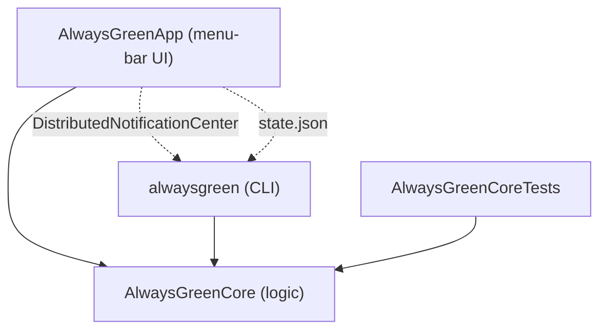

# Architecture

Always Green is a small macOS utility deliberately split so that all logic is isolated from the
untestable UI/AppKit glue. That split is what lets the `AlwaysGreenCore` library reach >=90% unit
coverage while the SwiftUI/`NSStatusItem` shell stays thin.

## Targets

The Swift package (`Package.swift`) defines four targets:

| Target | Kind | Contents | Depends on |
| --- | --- | --- | --- |
| `AlwaysGreenCore` | library | `JiggleEngine`, `IntervalPolicy`, `Command`, `AppState`/`AppStateStore`, `Config`, and the dependency protocols | (nothing) |
| `AlwaysGreenApp` | executable | `@main` app, `AppDelegate`, `NSStatusItem`/`NSPopover`, SwiftUI views, live protocol implementations | `AlwaysGreenCore` |
| `alwaysgreen` | executable | CLI `main.swift` | `AlwaysGreenCore` |
| `AlwaysGreenCoreTests` | test | fakes + tests for Core | `AlwaysGreenCore` |

The dependency rule points inward: both executables depend on Core; Core depends on nothing
(Foundation/Combine only). Nothing depends on the app or CLI.

## Dependency injection

`JiggleEngine` performs no I/O directly. Every side effect is behind a protocol injected through
its initializer, so tests substitute fakes and production wires live implementations:

| Protocol (Core) | Live implementation (App) | Responsibility |
| --- | --- | --- |
| `InputSynthesizing` | `CGEventInputSynthesizer` | Post the 1px cursor move (`CGEventPost`) |
| `DisplaySleepReading` | `PMSetDisplaySleepReader` | Read screen-sleep timeout (`pmset -g`) |
| `AccessibilityChecking` | `AXAccessibilityChecker` | Report/request Accessibility trust |
| `LoginItemControlling` | `SMLoginItem` | Launch-at-login (`SMAppService`) |
| `RepeatingTimer` | `TimerRepeatingTimer` | Restartable repeating timer |

`AppDelegate` composes these live implementations and hands them to `JiggleEngine`. The tests
build the same engine with `FakeInput`, `FakeDisplaySleep`, `FakeAccessibility`, `FakeLoginItem`,
and a manually-fired `FakeTimer`.

## State machine

`JiggleEngine` is a `@MainActor ObservableObject`. Key published state: `isRunning`,
`isAccessibilityTrusted`, `intervalSeconds`, `autoInterval`, `launchAtLogin`.

- `start()` refreshes trust, and only if trusted arms the timer, sets `isRunning`, jiggles once,
  and publishes state. `stop()` invalidates the timer.
- On each timer tick the engine calls `InputSynthesizing.jiggle()`.
- Interval: `setIntervalManually(_:)` pins a value and turns `autoInterval` off;
  `rederiveIntervalIfAuto()` recomputes from screen-sleep when still auto; `resetIntervalToAuto()`
  turns auto back on and recomputes.

`IntervalPolicy.derive(displaySleepSeconds:)` is the single, pure place the interval is chosen
(half of screen-sleep, floored at 15s, fallback 30s when Never/unknown or over 5 minutes).

## UI (MVVM-ish)

`JiggleEngine` doubles as the view-model: SwiftUI views (`MenuContentView`, `AboutView`) bind to
its published properties via `@EnvironmentObject`. `AppDelegate` owns the engine, creates the
`NSStatusItem` (its button sends on both mouse buttons so left-click opens the popover and
right-click toggles), and subscribes to `engine.$isRunning` to redraw the icon.

## Inter-process control

The CLI and app are separate processes that stay in sync two ways:

1. **Commands** - the CLI posts a `DistributedNotificationCenter` notification
   (`Config.commandNotificationName`, object = the verb); `AppDelegate` observes it and calls the
   matching engine method. `start`/`toggle` launch the app first if it is not running.
2. **Status** - the app writes `AppState` (running, interval, accessibilityTrusted) to
   `~/Library/Application Support/Always Green/state.json`; `alwaysgreen status` reads it.

Only the app holds the Accessibility grant, so terminal control never needs its own permission.
